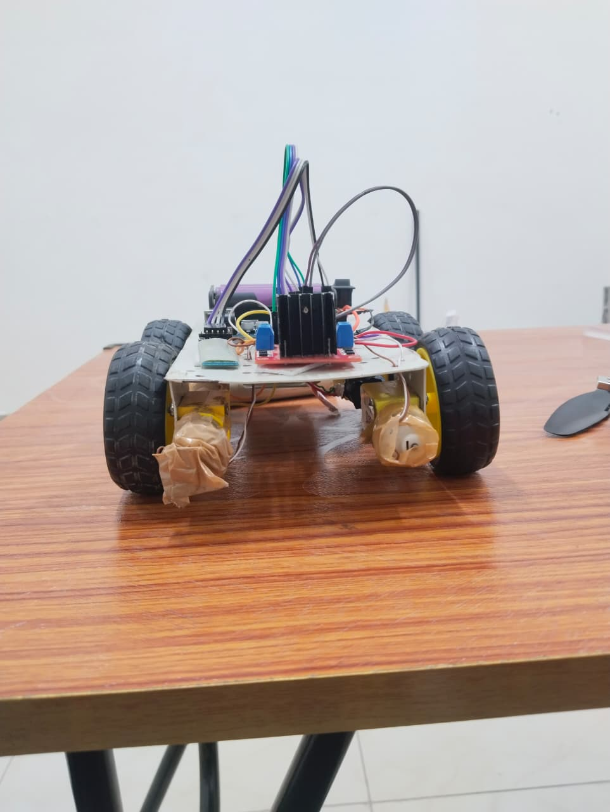
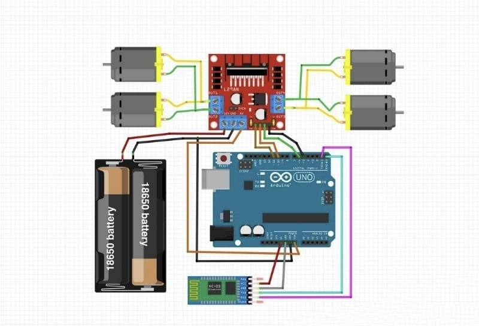

# Voice Control Car – SonicShift 🚗🔊



**Deployed in 2024**, SonicShift is an Arduino-based robotic car controlled via **voice commands** using Bluetooth. It can move forward, backward, turn left/right, and stop based on user input.

🏆 **Achievement:** Won **2nd Prize** at the college TechFest 2024

---

## Features
- Voice-controlled movements
- Forward, backward, left, right, and stop commands
- Arduino + DC motor H-bridge setup
- Bluetooth communication (HC-05/HC-06)
- Circuit diagram and demo images included

---

## Hardware Components
- Arduino Uno (or compatible board)
- 2 DC Motors with Motor Driver (L298N)
- Bluetooth module (HC-05/HC-06)
- Battery pack and chassis
- Jumper wires

---

## Software & Libraries
- Arduino IDE
- No additional libraries required (uses standard `digitalWrite` and `Serial`)

---

## Circuit Diagram


---

## How to Use
1. Connect the motors and Bluetooth module according to the circuit diagram.
2. Upload `voice_control.ino` to Arduino.
3. Pair your phone or computer via Bluetooth.
4. Open a Bluetooth terminal app.
5. Send commands:
   - `forward`
   - `backward`
   - `left`
   - `right`
   - `stop`
6. The car will move according to the received command.

---

## Arduino Code Snippet
```arduino
int motA_pin1 = 7;
int motA_pin2 = 6;
int motB_pin1 = 5;
int motB_pin2 = 4;
String command;

void setup() {
  pinMode(motA_pin1, OUTPUT);
  pinMode(motA_pin2, OUTPUT);
  pinMode(motB_pin1, OUTPUT);
  pinMode(motB_pin2, OUTPUT);
  Serial.begin(9600);
}

void loop() {
  if (Serial.available()) {
    command = Serial.readString();
    if (command == "forward") {
      // move forward
    } else if (command == "backward") {
      // move backward
    } else if (command == "left") {
      // turn left
    } else if (command == "right") {
      // turn right
    } else if (command == "stop") {
      // stop motors
    }
  }
}
